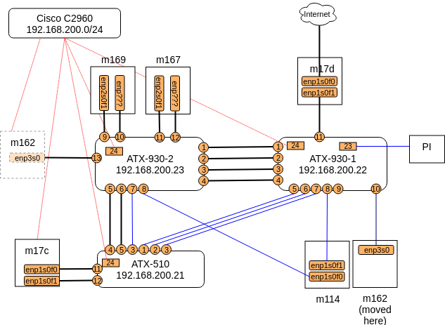

# SDN Testbed VUW

A SDN testbed setup for my thesis, where fBGP (based on Faucet) and gRCP prototype
are deployed.

## To deploy, execute the following:

ansible-playbook -i hosts.yml clean.yml

## Ansible specifications

### Playbooks
- clean.yml: clean the testbed hosts (remove folders, and docker things)
- run.yml: deploy the testebed
- host.yml: hosts definition and variables

### Roles

- router: used to deploy fBGP (+Faucet), it requires variables: `phys_intf`, `router_id`, `router_name`, `switch_dpid`, `interfaces`. See `hosts.yml` for example
- peer: used to deploy quagga BGP routers (simulating peers). It requires `peers` variable, `peer[id]` determines the peer ip
- reflector: used to deploy route reflector. need `reflector` variable
- monitor: used to deploy gauge monitor
